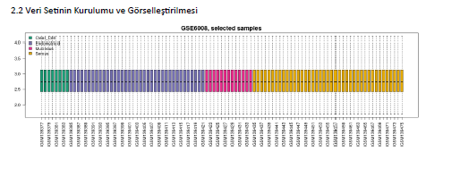
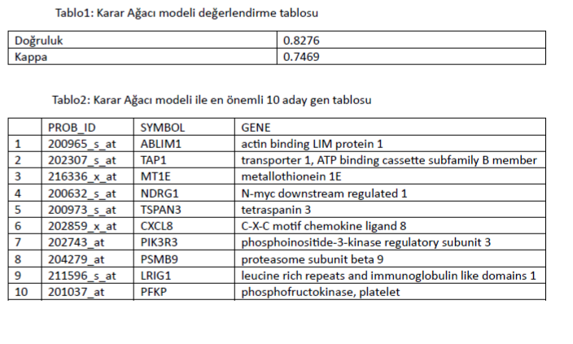
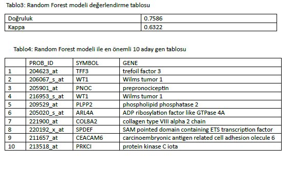
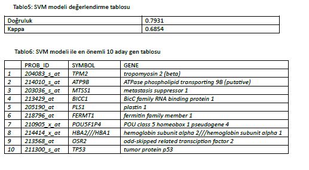

# Bioenformatic

classification-with-bio-data

Program for classification biological data for gene comparaison

## from
[@barisgevher](https://www.github.com/barisgevher) Software Engineer
## Screenshots

## Support

For support you can mail  barisgevher.inf@gmail.com .

  
## Technologies

**Languages:** R

  
## Rozetler

